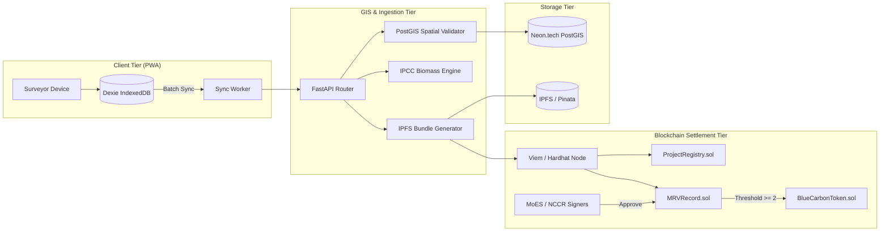

<div align="center">

  <h1>🌊 Meridien</h1>

  <p><strong>Decentralized Blue Carbon Registry & Plot-Verified MRV Infrastructure</strong></p>

  <p>
    An offline-first PWA and blockchain settlement engine converting coastal mangrove restoration field data into tamper-proof, plot-verified blue carbon credits.
  </p>

  <p>
    <a href="https://github.com/tyraakj/meridien/actions/workflows/ci.yml"></a>
    <a href="https://opensource.org/licenses/MIT"></a>
    <a href="https://soliditylang.org/"></a>
    <a href="https://fastapi.tiangolo.com/"></a>
    <a href="https://nextjs.org/"></a>
    <a href="https://postgis.net/"></a>
  </p>

  <p>
    <a href="#-the-problem">Problem</a> •
    <a href="#-architecture--pipeline">Architecture</a> •
    <a href="#-key-features">Key Features</a> •
    <a href="#-smart-contracts--tokenomics">Smart Contracts</a> •
    <a href="#-quick-start">Quick Start</a> •
    <a href="#-api-reference">API</a> •
    <a href="#-hackathon-context">Hackathon Info</a>
  </p>

</div>

---

## ⚡ At a Glance

| Traditional Blue Carbon MRV                            | **Meridien Plot-Verified Protocol**                               |
| :----------------------------------------------------- | :---------------------------------------------------------------- |
| ❌ Paper / manual spreadsheets lost in remote mudflats | ✅ **Offline-First PWA (Dexie.js + GPS coordinate tracing)**      |
| ❌ Overlapping boundary claims & double counting       | ✅ **PostGIS spatial topological integrity (`ST_Intersects`)**    |
| ❌ Low-trust credits disconnected from ground truth    | ✅ **Canonical IPFS audit bundles anchored on-chain via SHA-256** |
| ❌ Regulators (MoES/NCCR) lack visibility              | ✅ **2-of-3 Verifier Multi-Sig Gate before credit minting**       |
| ❌ Opaque carbon offset retirements                    | ✅ **On-chain ERC-20 burn with cryptographic certificate trace**  |

---

## 🛑 The Problem

India's 7,500+ km coastline harbors vital blue carbon ecosystems (_Sundarbans, Pichavaram, Gulf of Khambhat, Bhitarkanika_) capable of sequestering up to **10× more carbon per hectare** than terrestrial tropical rainforests.

However, restoration projects face three fundamental bottlenecks:

1. **Zero-Connectivity Coastal Zones:** Field monitoring happens in remote intertidal zones with no cellular signal. Ground data is often lost or unverified.
2. **Boundary Conflicts & Double-Counting:** Without centralized GIS validation, overlapping boundaries lead to duplicate carbon claims across NGOs and forest departments.
3. **Greenwashing & Lack of Provenance:** Carbon buyers cannot verify whether a credit corresponds to real, alive mangrove biomass or a paper calculation.

---

## 💡 The Meridien Solution

Meridien bridges the physical-to-digital gap across a 5-stage pipeline:

```
[ Field Team ] ──(Offline GPS Walk + Geotagged Photos)──► [ Dexie.js IndexedDB ]
                                                                   │
                                                   (Online Batch Ingestion)
                                                                   ▼
                                                       [ FastAPI GIS Engine ]
                                                       ├── PostGIS Overlap Check
                                                       ├── IPCC Biomass Modeling
                                                       └── IPFS Bundle Pinning
                                                                   │
                                                   (SHA-256 Hash Anchor)
                                                                   ▼
[ Public Registry ] ◄──(Mint BCT Token)── [ MRVRecord.sol (2-of-3 Multi-Sig) ]
```

---

## 🚀 Key Capabilities

### 📱 1. Offline-First PWA Field Capture

- **GPS Polygon Boundary Walking:** High-accuracy boundary polygon tracing using HTML5 Geolocation API with geodesic area calculation.
- **EXIF Geotagged Evidence:** Captures quadrat field photos with embedded coordinates and timestamps stored locally in **IndexedDB**.
- **Auto-Sync Queue:** Reconnects seamlessly in background when cellular connectivity returns.

### 🗺️ 2. Spatial GIS & Biomass Modeling Engine

- **PostGIS Topological Validation:** Rejects invalid geometries and prevents overlapping claims using `ST_Intersects` and deterministic boundary hashing.
- **IPCC Tier 2 Mangrove Allometric Model:** Calculates dry biomass ($AGB + BGB$), vegetation carbon, and soil organic carbon pool based on Indian species parameters (_Rhizophora_, _Avicennia_).

### 📦 3. Hybrid Decentralized Storage

- **Neon.tech Cloud PostGIS:** High-speed relational queries, polygon indexing, and project metadata.
- **IPFS / Pinata:** Immutable content-addressed storage for high-resolution field photos and signed canonical MRV audit packages.

### ⛓️ 4. Multi-Sig Settlement Smart Contracts

- **`ProjectRegistry.sol`:** Stores project lifecycle states and canonical boundary hashes.
- **`MRVRecord.sol`:** Holds submitted MRV reports and enforces a **2-of-3 verifier multi-sig threshold** (MoES + NCCR).
- **`BlueCarbonToken.sol` (`BCT`):** Standard ERC-20 token where **$1.0\text{ BCT} \equiv 1.0\text{ metric ton of sequestered } CO_2e$**. Supports public on-chain credit retirement with immutable certificate generation.

---

## 🏗️ System Architecture



---

## 🪙 Smart Contracts & Tokenomics

```solidity
// 1.0 BCT = 1 tCO2e (18 Decimals)
contract BlueCarbonToken is ERC20, Ownable {
  function mint(address to, uint256 amount, uint256 reportId) external onlyMRVController;
  function retire(uint256 amount, string calldata beneficiary, string calldata reason) external;
}
```

- **Minting Gate:** Tokens can **only** be minted by `MRVRecord.sol` once **at least 2 verified authorities** (e.g. Ministry of Earth Sciences + National Centre for Coastal Research) cryptographically sign off on the field audit.
- **Retirement Mechanism:** Buyers call `retire(amount, beneficiary, reason)` to permanently burn credits. The contract emits `CarbonRetired`, generating an open verifiable certificate.

---

## ⚡ Quick Start

### Prerequisites

- **Node.js**: v22 LTS+
- **pnpm**: v11+
- **Python**: v3.11+ with **uv**
- **Cloud Database**: Managed PostGIS on [Neon.tech](https://neon.tech) (or local Docker)

### 1. Clone & Setup Config

```bash
git clone https://github.com/tyraakj/meridien.git
cd meridien
cp .env.example .env
```

### 2. Smart Contracts & Hardhat Tests (`frontend/`)

```bash
cd frontend
pnpm install
pnpm approve-builds keccak secp256k1

# Run 9/9 Hardhat Smart Contract Tests
pnpm run test:contracts
```

### 3. Backend Ingestion Engine (`backend/`)

```bash
cd ../backend
uv sync

# Run 6/6 GIS & Biomass Pytest Tests
uv run pytest tests/ -v

# Start FastAPI API Server
uv run uvicorn app.main:app --reload --port 8000
```

### 4. Frontend PWA (`frontend/`)

```bash
cd ../frontend
pnpm run dev
```

Visit **[http://localhost:3000](http://localhost:3000)** in your browser.

---

## 🧪 Test Verification

<details>
<summary><b>View Smart Contract Test Output (9/9 Passed)</b></summary>

```text
  Meridien Core Smart Contract Suite
    1. Deployment & Permissions
      ✔ should initialize contracts with correct owner and controllers
      ✔ should reject direct unauthorized token minting
    2. Project Registration (ProjectRegistry)
      ✔ should allow a project developer to register a plot
      ✔ should reject duplicate boundary hash registrations (Anti-Double-Counting)
    3. MRV Report Submission & Multi-Sig Verification (MRVRecord)
      ✔ should allow surveyor to submit an MRV audit report
      ✔ should require 2 verifier approvals before minting Blue Carbon Tokens (BCT)
      ✔ should reject approvals from non-verifiers
    4. Credit Settlement & Voluntary Retirement (BlueCarbonToken)
      ✔ should allow buyer to permanently retire (burn) verified carbon credits
      ✔ should reject retirement if balance is insufficient

  9 passing (1s)
```

</details>

<details>
<summary><b>View Backend GIS & Biomass Pytest Output (6/6 Passed)</b></summary>

```text
tests/test_biomass.py::test_single_tree_biomass_calculation PASSED       [ 16%]
tests/test_biomass.py::test_mangrove_total_tco2e PASSED                  [ 33%]
tests/test_biomass.py::test_zero_tree_edge_case PASSED                   [ 50%]
tests/test_gis_service.py::test_valid_geojson_polygon PASSED             [ 66%]
tests/test_gis_service.py::test_invalid_polygon_self_intersecting PASSED [ 83%]
tests/test_gis_service.py::test_deterministic_boundary_hash PASSED       [100%]

============================== 6 passed in 8.44s ==============================
```

</details>

---

## 🔌 API Reference Surface

| Method | Endpoint                            | Description                                         | Role / Auth          |
| :----- | :---------------------------------- | :-------------------------------------------------- | :------------------- |
| `POST` | `/api/v1/auth/register`             | Register surveyor, verifier, or developer           | Public               |
| `POST` | `/api/v1/auth/login`                | Authenticate & retrieve JWT token                   | Public               |
| `POST` | `/api/v1/plots/register`            | Register restoration plot with GeoJSON boundary     | Developer / Surveyor |
| `GET`  | `/api/v1/plots`                     | List & filter plots with bounding box spatial query | Public               |
| `GET`  | `/api/v1/plots/{id}`                | Get plot geometry, history & boundary hash          | Public               |
| `POST` | `/api/v1/mrv/sync-batch`            | Offline sync ingestion for field surveys            | Surveyor             |
| `GET`  | `/api/v1/mrv/reports`               | List submitted MRV reports for audit                | Verifier / MoES      |
| `POST` | `/api/v1/mrv/reports/{id}/approve`  | Submit multi-sig verifier approval vote             | Verifier (MoES/NCCR) |
| `GET`  | `/api/v1/registry/stats`            | National aggregate metrics (hectares, tCO2e)        | Public               |
| `GET`  | `/api/v1/registry/certificate/{id}` | Retrieve public verifiable retirement certificate   | Public               |

---

## 🏆 Hackathon Context

- **Event:** Smart India Hackathon 2026
- **Problem Statement ID:** `SIH26038` — _Blockchain-Based Blue Carbon Registry and MRV System_
- **Theme:** Clean & Green Technology
- **Team Name:** Git Push Pray
- **Team ID:** `SIH2601`
- **Lead Developer:** [@tyraakj](https://github.com/tyraakj) (`tyra191712@gmail.com`)

---

<div align="center">
  <sub>Built with 🌊 for India's coastal mangrove ecosystems. Licensed under <a href="LICENSE">MIT</a>.</sub>
</div>
